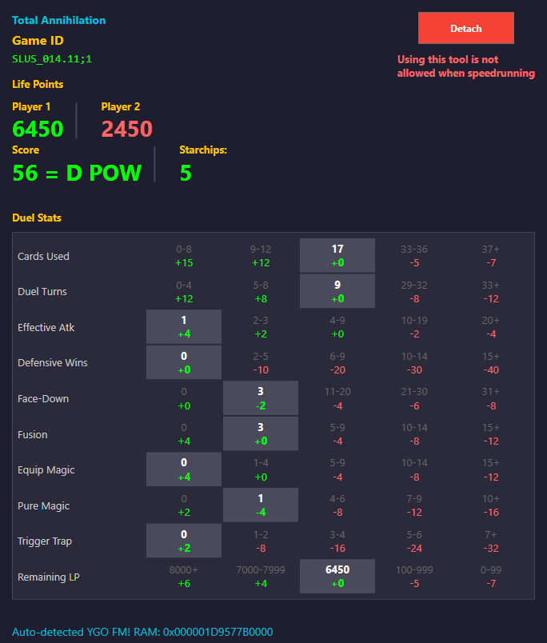

# FMR Auto-Tracker

[**Download**](https://github.com/seth-rah/FMR-Auto-Tracker/releases)

---

A real-time memory monitoring tool for Yu-Gi-Oh! Forbidden Memories, designed to track duel statistics and calculate performance scores while playing on the DuckStation PS1 emulator.

## Disclaimer

This tool is not allowed when speedrunning, as reading memory is not allowed for leaderboard submissions. You could say... it's Forbidden Memory... ha... ha.. hmmm. 

This is purely a tool for casual play and familiarising yourself with the games mechanics. Maybe grab some retro achievements along the way.



## Features

- **Real-time Memory Monitoring**: Reads game state directly from DuckStation's memory
- **Auto-Detection**: Automatically detects YGO FM (SLUS_014.11) RAM location
- **Star Chips Tracking**: Tracks current star chips total
- **Duel Statistics Tracking**:
  - Life points 
  - Cards used
  - Duel turns
  - Effective attacks
  - Defensive wins
  - Face-Down plays
  - Fusions
  - Equip magic activated
  - Spell cards activated
  - Traps activated
- **Score Calculation**: Calculates duel rank (S/A/B/C/D | POW/TEC)

## Requirements

### Runtime
- Windows 10/11
- [.NET 10 Runtime](https://dotnet.microsoft.com/download/dotnet/10.0)
- [DuckStation](https://www.duckstation.org/) (PS1 emulator)
- Yu-Gi-Oh! Forbidden Memories (SLUS-014.11)

### Build
- [.NET 10 SDK](https://dotnet.microsoft.com/download/dotnet/10.0)

## Building

```bash
git clone https://github.com/seth-rah/FMR-Auto-Tracker.git
cd FMR-Auto-Tracker
dotnet build --configuration Release
```

Run `FMR-Auto-Tracker.exe` from `bin/Release/net10.0-windows/`

## Usage

1. Start DuckStation and load Yu-Gi-Oh! Forbidden Memories
2. **Important**: the game should be active when attaching to the Duckstation process. If you attach to duckstation without the game running, then the data won't be correct.
3. Launch FMR Auto-Tracker
4. The app will automatically attach to the DuckStation process
5. Start a duel to see real-time statistics

### Troubleshooting

Click Detach / Attach if the values being shown don't line up with the game. It's possible tool was opened before duckstation had the game loaded. 

### Command Line Arguments

| Argument | Description |
|----------|-------------|
| `--debug` | Enable debug log panel for troubleshooting |

**Example:**
```bash
FMR-Auto-Tracker.exe --debug
```

## Architecture

```
├── ProcessHook/     # Low-level memory access (Win32 API)
├── DataModel/       # Immutable data structures
├── DataReader/      # Game state reading from memory
├── LogicEngine/     # Business logic, score calculation
└── UI Layer         # WPF presentation
```

## Acknowledgments

- DuckStation team for the PS1 emulator
- Yu-Gi-Oh! Forbidden Memories community for memory research